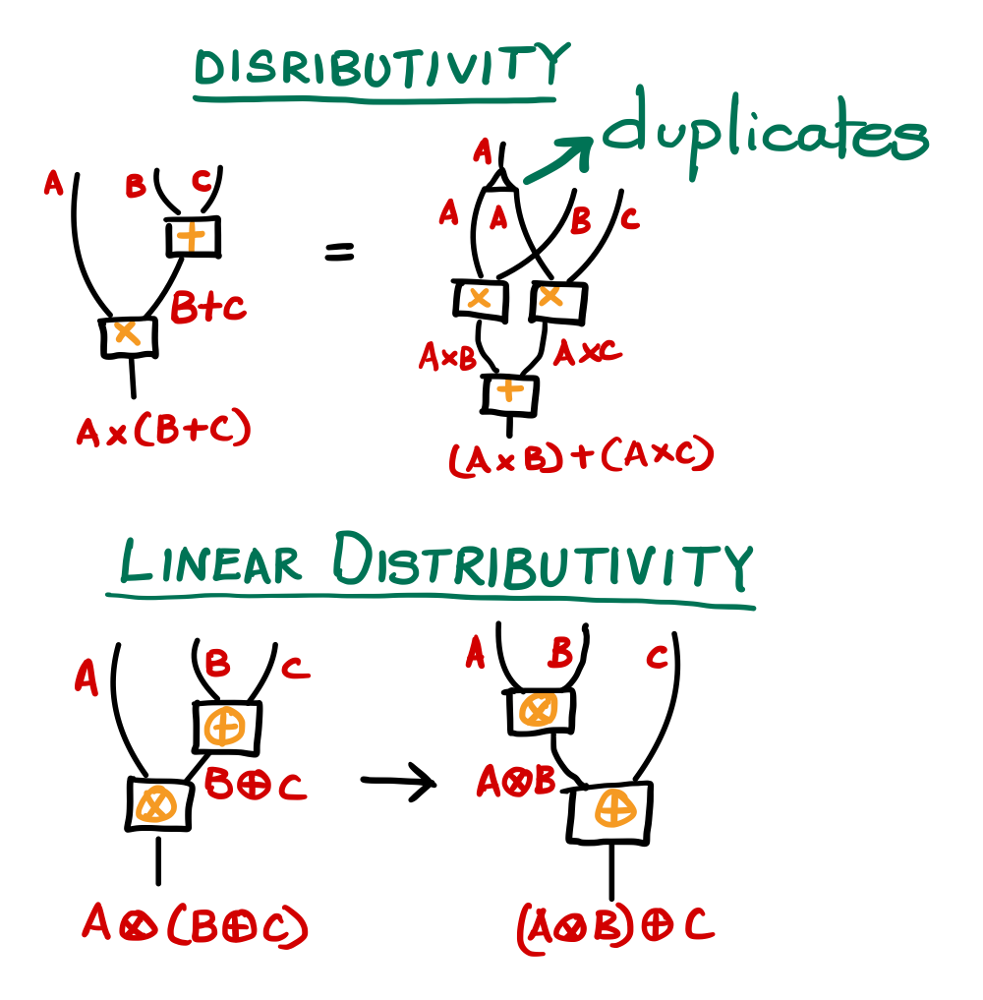

<!-- title -->

# E5. Linearly distributive categories -- Part I

In the [previous episode](/chapter1/LinearlogicToQuantum) we saw how multiplicative linear logic provides a pictorial way of 'computing' quantum processes using its categorical proof theories. In this episode, we shall look the multiplicative linear logic through the lens of category theory. 

 

Linearly distributive categories provide the categorical semantics for multiplicative linear logic. But, what does that mean? Linearly distributive categories are precisely the multiplicative fragment of linear logic (consisting of $\otimes$, $\top$, $\oplus$, and $\bot$ ) expressed in the language of category theory. Choosing category theory to express the logic throws a new perspective which is not quite visible in the logic's sequent calculus. 

::: tip What is sequent calculus?

Logicians use sequent calculus method to calculate proofs by stacking the arguments. For example, 

$$ 
\begin{prooftree}
		\AxiomC{...}
		\UnaryInfC{Statement A}
		\LeftLabel{\small(Rule P)}
		\UnaryInfC{Statement B}
        \LeftLabel{\small(Rule Q)}
		\UnaryInfC{Statement C}
\end{prooftree}
$$

The above is a proof that Statement C holds. Read it as, "If 'statement A' holds, then 'statement B' holds because of 'Rule P'. If  'statement B' holds then 'statement C' holds by 'Rule Q'. Statement A holds because of some other statements and rules." Each statement is a referred to as a **sequent** reminding us of sequential processes. 

A sequent is of the following form which (in linear logic) means given resource $C$, one can obtain resource $D$. 
$$ 
\begin{prooftree}
		\AxiomC{$C \dashv D$}
\end{prooftree}
$$

Sequent calculus = a method of calculating sequents

When we move from logic to category theory, the sequents become maps in a corresponding category, and  the sequent rules become coherences (but it usually is not a straightforward one-to-one translation between the logic and its categorical semantics). 

$$
\begin{align*}
\text{sequents in logic} &\sim \text{maps in a category} \\ 
\text{sequent rules}  &\sim \text{coherence conditions} 
\end{align*}
$$

The cut-rule is perhaps the most important rule in any logic, which tells how to compose sequents. Suppose, resource $D$ can be obtained from resource $C$, and resource $E$ can be obtained from resource $D$, then the cut-rule tells allows us to infer that resource $E$ can be obtained from resource $C$.

$$ 
\begin{prooftree}
		\AxiomC{dollar $\dashv$ apple \quad apple $\dashv$ appple juice}
		\LeftLabel{\small(cut)}
		\UnaryInfC{dollar $\dashv$ apple juice}
\end{prooftree}
$$

The cut rule **cuts** the common point :scissors: The cut rule of the logic is what manifests as the compostion of maps in the categorical semantics.

$$ \text{cut-rule} \sim \text{composition} $$

:::

So, what is the perspective shift that we gain by moving to linearly distributive categories? These categories make explicit the fundamental role of what is called "linear distributivity" in the logic. Linear distributivity tells us how the  pairs of multiplicatives -- the tensor and its unit $(\otimes, \top)$, and the par and its unit $(\oplus, \bot)$ -- interact. Here is the sequent which captures interaction:

$$ A \otimes (B \oplus C) \dashv (A \otimes B) \oplus C$$

The above interaction is known as the *linear distributivity*. It is linear in the sense that it is different from the distribution of product over sum. For example, in the equation below, when the product $\times$ distributes over the sum $+$, we can say that the number 5 is duplicated, one copy is multiplied by 3 and the other copy is multipied by 8, and the products are summed.

$$
5 \times (3 + 8) = (5 \times 3) + (5 \times 8)
$$
Compare this with linear distributivity where the tensor distributes over the par by NOT duplicating $A$ and also the implication is ONE-WAY (not an equality).

Below is a semi-formal pictorial representation of distributivity vs linearly distributivity. Hidden within the canonical distributivity is the act of duplicating the term which is multiplied. This is apparent when we 'draw' the equation:

Linear distributivity seems strange at the first sight! What sort of 'systems' are linearly distributive? Certainly, not the number system! But, we will work on this, developing an intution for this strange looking distributivity formula. 

But, wait! Are we not supposed to talk about linearly distributive categories? We have been secretly talking about them. Linear distributivity is the :heart: and soul of linearly distributive categories. If you have been wondering why these categories have been called so, you know the answer now! With linear distributivity and certain coherence conditions, these categories recover the whole of the multiplicative linear logic.

In the [next episode](/chapter1/LDC2.md), we shall see how linear distributivity is dervied from the basic rules of linear logic, and meet the linearly distributive categories in its full form! :dancer: :tada: 

