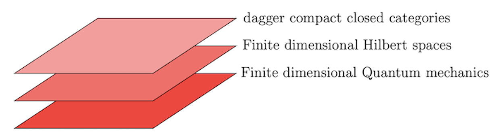
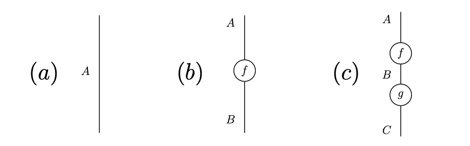
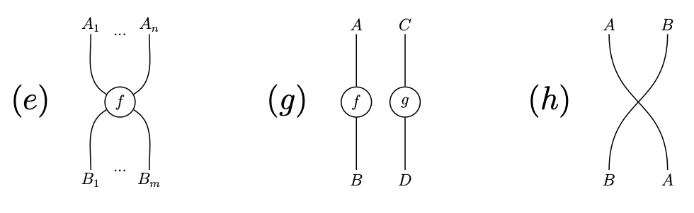
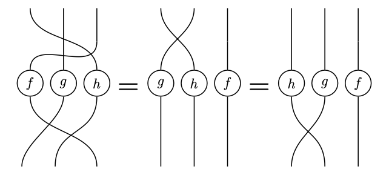
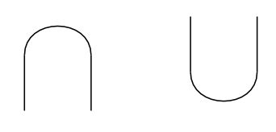

<!-- title -->

# E4. From linear logic to quantum mechanics

Traditionally, Hilbert spaces are used as the mathematical framework of quantum mechanics. While this framework support detailed computation, they 
do not support an intuition for the problem: this leads to an approach described as "shut up and calculate". 
The programme of **categorical quantum mechanics**   emerged out of the desire to develop an intuitive framework that aids human thinking to represent and reason about quantum processes. What is more intuitive than pictures! Categorical quantum mechanics indeed gave a pictorial way to represent quantum process, yet these pictures have precise meaning to them. 

Linear logic captures the essence of quantum mechanics owing to its 
resource-sensitive character. We saw that in linear logic one cannot duplicate an arbitrary resource: in quantum mechanics, this is 
referred to as the *no-cloning theorem* which states that it is impossible to duplicate an arbitrary quantum state. 
Motivated by this connection, the field of categorical quantum mechanics uses the compact multiplicative linear logic as the base framework for its purpose, 
and added the notion of dagger to this fragment, thus giving rise to compact dagger-linear logic.  The 'dagger' abstracts the notion of 'adjoint' 
which is crucial to quantum mechanics: the measurable properties of a quantum system are 
given by self-adjoint operators on a separable Hilbert space, that is, a Hilbert space with 
countable orthonormal basis. 

While monoidal categories provide the semantics for compact MLL, dagger-monoidal categories provide the categorical semantics for 
compact dagger-linear logic.  CQM uses dagger-monoidal categories,  specifically, dagger compact closed 
categories to develop a high-level, intuitive, formal language for quantum mechanics 
by abstracting the standard, traditionally-used, analytical framework of Hilbert spaces, as illustrated below:

In 2004, Abramsky and Coecke [[1]](https://arxiv.org/abs/quant-ph/0402130) described the fundamental axioms of quantum mechanics 
within the framework of dagger compact closed categories. 
This was quite significant as it meant that the proof theory 
based on string diagrams of monoidal categories [[2]](https://www.sciencedirect.com/science/article/pii/S1571066107000606), 
could be deployed to reason about quantum processes. For example, in CQM, 
physical systems are represented as wires and processes as circles.  
The label of a wire represents its type. Diagram $(a)$ represents a system $A$, and 
diagram $(b)$ represents a transformation from system $A$ to system $B$.
 Processes can composed sequentially by connecting the wires 
with matching types. Note that the string diagrams are to be read 
from top to bottom (following the direction of gravity), and from left to right. 

Moreover, the wires and the boxes can be composed in parallel leading to processes as shown in diagrams 
$(e)$ and $(f)$. Morever, the wires are allowed to cross one another another as shown in diagram $(g)$.

It is far simpler to reason about processes using string diagrams since the human brain is good at processing visual information. 
For example, it is quite easy to see that the diagrams below represent the same process: one can prove the diagrams equal by 
fixing the ends of the wires and moving the circles. 

In compact closed categories, one can additionally bend wires into a cap and a cup as follows, thus adding to the expressive power of the language: 

The dagger compact closed categories faithfully abstract the structure of finite-dimensional Hilbert spaces, 
thereby enabling a diagrammatic but rigorous reasoning technique for quantum processes and protocols
within the category of finite-dimensional Hilbert spaces and linear maps. 

I hope that I have convinced you that linear logic and its categorical presentations are interesting to understand! 
In the [next episode](/chapter1/LDC.md), we shall introduce the star of the series, the linearly distributive categories which are the categorical presenation of multiplicative linear logic! :tada: :smile:

**References**

[1]. Samson Abramsky and Bob Coecke. “A Categorical Semantics of Quantum Proto- cols”. In: Proceedings of the 19th Annual IEEE Symposium on Logic in Computer Science. LICS ’04. Washington, DC, USA: IEEE Computer Society, 2004, pp. 415– 425. isbn: 0-7695-2192-4. 

[2]. Peter Selinger. “Dagger compact closed categories and completely positive maps”. In: Electronic Notes in Theoretical Computer Science 170 (2007), pp. 139–163.